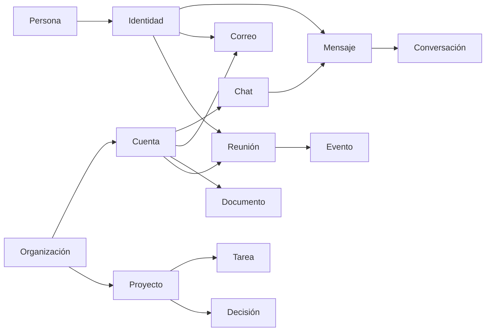

Cada herramienta de WireCat — `tg`, `max`, `memo`, `zm` — guarda lo que lee en un único archivo
SQLite local, `wirecat.db`. Esta página es para desarrolladores y autores de agentes que quieren
consultar ese archivo o entender qué puede encontrar un agente en él. Explica primero las
entidades, después cómo se conectan, después cómo una búsqueda encuentra contexto y solo al final
las columnas por las que vale la pena consultar. Cómo se abre, migra y bloquea el almacén está en
[el almacén local](./architecture.mdx#el-almacén-local).

Describe el esquema tal como se leyó el 10 de octubre de 2026, en un commit fijo de cli-messaging,
el paquete dueño del archivo. Cada columna con su significado está en la
[referencia del esquema](https://github.com/WireCatLabs/cli-messaging/blob/d7b948a/docs/storage/schema-v2.md).

## Entidades

### Personas e identidades

Una **persona** es un ser humano. Una **identidad** es cómo una fuente conoce a una persona: un
usuario de Telegram, un usuario de MAX, una dirección de correo, un participante de Zoom. Una
persona tiene muchas identidades; cada identidad pertenece como mucho a una persona, y junto al
vínculo se guardan el método y la confianza con que se hizo. Los perfiles anteriores se guardan como
revisiones. Un **bot** es un agente de IA o un script que trabaja en el almacén: puede ser dueño de
proyectos, tomar tareas y escribir notas. El bot propio de un mensajero es una identidad, no un bot.

### Organizaciones y proyectos

Una **organización** es una empresa, un equipo, una familia o una comunidad. Un **proyecto** es un
lugar para tareas, con una clave corta (`MEET`), un tipo (trabajo, cliente, personal, código
abierto, otro) y una organización opcional. Las cuentas de trabajo y los proyectos pertenecen a una
organización; una familia también es una organización.

### Cuentas y chats

Una **cuenta** es una integración que el dueño conectó: una cuenta de mensajería, un buzón de
correo, Zoom, una carpeta de notas. Un **chat** pertenece a una cuenta. Los chats se anidan: un tema
de foro está dentro de su grupo, y el grupo de discusión de un canal está bajo el canal. Un hilo es
otra cosa: cuelga de un mensaje raíz dentro de un chat, como los comentarios bajo una publicación
de un canal.

### Mensajes y conversaciones

Un **mensaje** pertenece a un chat y lo envía una identidad. Las ediciones conservan el texto
anterior, y un mensaje borrado en la fuente conserva su fila sin su texto. Una **conversación** es
un grupo de mensajes de un chat que pertenecen a la misma discusión, reconstruido a partir de
respuestas, menciones y del mismo remitente que continúa
([cómo se construyen](./search-architecture.mdx#3-reconstruir-conversaciones-con-un-grafo-de-mensajes)).

### Correo

Un **correo** pertenece a un hilo de correo y a una cuenta. Su remitente y cada destinatario (to,
cc, bcc) se resuelven a identidades, así que los correos y los mensajes de la misma persona se
encuentran en una sola persona. Las carpetas y etiquetas son buzones; un correo puede estar en
varios.

### Documentos, notas y memorias

Un **documento** existe por sí mismo: un archivo en una carpeta de notas, una página, una página de
wiki. Una **nota** es un texto breve que una persona o un bot escribió sobre una cosa: una persona,
un chat, una reunión, una tarea; los comentarios de una tarea son notas. Una **memoria** es lo que
concluyó un agente: un resumen, un resumen diario, un hecho, una preferencia. Una memoria puede
equivocarse, así que siempre lleva sus pruebas, una confianza y un estado (propuesta, confirmada,
obsoleta, sustituida).

### Eventos y reuniones

Un **evento** es el registro del dueño de algo que ocurrió, sin campos de ningún proveedor. Una
**reunión** es una ocurrencia tal como la registró una aplicación de reuniones: sus participantes,
transcripciones, chat de la reunión y resúmenes. Una reunión apunta a su evento, así que los
registros de la misma llamada desde distintas fuentes se encuentran en un solo evento. Los eventos
y las reuniones que se repiten tienen cada uno su serie.

### Tareas y decisiones

Una **tarea** pertenece a un proyecto y se nombra con su clave y su número (`MEET-12`). Su tipo es
error, función, mantenimiento, pregunta, petición, mención o promesa: una pregunta que alguien hizo
es una tarea de tipo pregunta, y una promesa que alguien hizo es una tarea de tipo promesa. Personas
y bots se asignan con un rol (responsable, revisor, observador), y cada cambio es un evento de la
tarea. Una **decisión** es una elección que vale hasta que otra la sustituye, con sus pruebas
vinculadas.

### Etiquetas y temas

Una **etiqueta** es un rótulo libre que cualquiera puede añadir. Un **tema** es una etiqueta de una
lista corta que solo crea el dueño; los agentes pueden proponer uno. Una cosa puede llevar muchas
etiquetas y temas, y un tema puede marcarse como el principal. Un nombre es o etiqueta o tema, nunca
las dos cosas.

### Acciones propuestas y registradas

Una **acción propuesta** es algo que un agente quiere hacer fuera del almacén — responder, enviar,
expulsar, crear una tarea — y que espera a que una persona la apruebe o la rechace. Nada externo
ocurre sin esa aprobación. Aparte, cada herramienta que llama un agente queda registrada con su
nivel de acceso y su objetivo, sin el texto de sus argumentos.

## Cómo se conectan



En palabras: una persona tiene identidades; las identidades envían mensajes y correos y participan
en reuniones. Una organización agrupa cuentas y proyectos. Cada cuenta trae sus chats, correos,
documentos y reuniones; los chats contienen mensajes, y los mensajes se agrupan en conversaciones.
Una reunión pertenece a un evento. Un proyecto contiene tareas y decisiones.

Cuatro tablas conectan cualquier cosa con cualquier otra, así que ninguna entidad de arriba
necesita una columna para cada una de las demás:

- **Los vínculos** (links) unen dos cosas con un tipo: una tarea de pregunta con el mensaje que la
  respondió (`answered-by`), una decisión o una memoria con su prueba (`evidence`), una cosa con
  aquello de lo que se hizo (`created-from`), una tarea con las personas, mensajes, correos y
  reuniones a los que se refiere.
- **Las asignaciones de etiquetas** (taggings) ponen una etiqueta o un tema en cualquier cosa.
- **Las notas** añaden el texto de una persona a cualquier cosa.
- **Los alias** (aliases) dan otros nombres a cualquier cosa: un apodo, el nombre de un contacto en
  un mensajero, el nombre corto de un proyecto. Los leen la búsqueda y la resolución de nombres.

**El ámbito** (scope) es `personal` o `work`. Se fija en cuentas, organizaciones y proyectos, y lo
que contienen lo hereda: un chat toma el ámbito de su cuenta salvo que fije el suyo, y una memoria
toma el ámbito de sus pruebas. Una pregunta hecha para el trabajo lee solo datos de trabajo, así que
nunca trae un chat privado.

## Cómo la búsqueda encuentra contexto

Encontrar contexto para un agente son tres pasos, en este orden.

1. **Acotar con tablas.** Persona, proyecto, cuenta, tiempo y ámbito son columnas con índices, así
   que el primer paso es SQL corriente. El índice de participación es el atajo: una fila por
   persona y por cada mensaje, correo, reunión, tarea o documento en que participó, con su rol, el
   momento y el ámbito. «Todo lo que Alice Example hizo en el trabajo este mes» es un solo rango
   del índice.
2. **Buscar palabras y significado solo entre los candidatos.** Cada tipo de texto tiene su propio
   índice de palabras y de raíces: mensajes, correos, adjuntos, documentos, notas, memorias y
   reuniones. Después los vectores ordenan por significado, y cada fragmento de texto lleva el
   ámbito, la cuenta, el proyecto y el momento de su origen, así que el recorrido de vectores
   filtra antes de comparar. Cómo funcionan las palabras, las raíces y los vectores se explica en
   [cómo funciona la búsqueda](./search-architecture.mdx#4-fragmentos-y-vectores).
3. **Ampliar por los vínculos.** Desde un resultado, seguir la cadena de respuestas, la
   conversación a la que pertenece, la raíz del hilo, el hilo de correo o la reunión de la que vino
   una fila de transcripción, y los vínculos que apuntan a él.

```sql
SELECT subject_type, subject_id, role, occurred_at
FROM involvements
WHERE person_id = :person AND scope = 'work' AND occurred_at >= :since
ORDER BY occurred_at DESC
LIMIT 50
```

Los vectores son de los textos largos: conversaciones, documentos, correos, el texto de los
adjuntos, notas, memorias, transcripciones y resúmenes de reuniones, eventos y tareas. Un mensaje suelto
nunca tiene vector propio; se encuentra por palabras, o por significado a través de su
conversación. Un texto se corta en fragmentos, y el vector de cada fragmento se guarda una vez por
modelo y hash del texto, así que el mismo texto nunca se vectoriza dos veces.

El índice de participación es derivado: se reconstruye a partir de remitentes, destinatarios,
participantes, responsables y vínculos confirmados, y no contiene nada que ellos no tengan.

## Columnas clave

Solo las columnas por las que un lector filtraría o uniría. Los tiempos son milisegundos de época.
Un par `<name>_type` y `<name>_id` apunta a una fila de cualquier tabla: `person`, `message`,
`task`.

**Fuentes y personas**

| Tabla | Consultar por |
| --- | --- |
| `accounts` | `provider`, `scope`, `organization_id` |
| `persons` | `name` |
| `identities` | `provider`, `external_id`, `username`, `name` |
| `identity_links` | `identity_id`, `person_id`, `confidence` |
| `organizations` | `kind`, `scope` |
| `bots` | `name`, `kind`, `owner_person_id` |

**Chats, mensajes y correo**

| Tabla | Consultar por |
| --- | --- |
| `chats` | `account_id`, `kind`, `parent_chat_id`, `scope`, `last_message_at` |
| `messages` | `chat_id`, `sender_identity_id`, `sent_at`, `thread_root_id`, `reply_to_external_id`, `deleted_at` |
| `conversations` | `chat_id`, `first_at`, `last_at` |
| `emails` | `account_id`, `email_thread_id`, `from_identity_id`, `sent_at` |
| `email_recipients` | `email_id`, `identity_id`, `role` |

**Documentos, notas y memorias**

| Tabla | Consultar por |
| --- | --- |
| `documents` | `account_id`, `kind`, `title`, `extension`, `deleted_at` |
| `notes` | `notable_type`, `notable_id`, `author_type`, `author_id` |
| `memories` | `kind`, `subject_type`, `subject_id`, `status`, `scope` |

**Eventos y reuniones**

| Tabla | Consultar por |
| --- | --- |
| `events` | `starts_at`, `event_series_id` |
| `meetings` | `account_id`, `event_id`, `started_at`, `host_identity_id` |
| `meeting_participants` | `meeting_id`, `identity_id`, `role` |
| `meeting_transcript_rows` | `meeting_transcript_id`, `speaker_participant_id`, `start_ms` |

**Tareas, decisiones y acciones**

| Tabla | Consultar por |
| --- | --- |
| `projects` | `key`, `type`, `organization_id`, `scope` |
| `tasks` | `project_id`, `key`, `type`, `status`, `due_at`, `parent_id` |
| `task_assignments` | `task_id`, `assignee_type`, `assignee_id`, `role` |
| `decisions` | `project_id`, `status`, `decided_at`, `supersedes_id` |
| `proposed_actions` | `status`, `kind`, `target_type`, `target_id` |

**Conexiones y búsqueda**

| Tabla | Consultar por |
| --- | --- |
| `links` | `from_type`, `from_id`, `to_type`, `to_id`, `kind` |
| `taggings` | `tag_id`, `taggable_type`, `taggable_id`, `main` |
| `tags` | `name`, `kind` |
| `aliases` | `aliasable_type`, `aliasable_id`, `name_folded` |
| `involvements` | `person_id`, `identity_id`, `occurred_at`, `scope`, `subject_type`, `subject_id` |
| `chunks` | `chunkable_type`, `chunkable_id`, `scope`, `occurred_at`, `content_hash` |
| `embeddings` | `model`, `content_hash` |

<details id="conventions" className="docs-disclosure">
<summary>Convenciones de nombres y todas las tablas</summary>

- Las tablas van en plural y en snake_case. La clave primaria es `id`; una clave foránea es
  `<singular>_id`.
- `external_id` es el id propio de la fila en la fuente; el id de otra cosa en la fuente es
  `<thing>_external_id`.
- `created_at` y `updated_at` dicen cuándo se guardó y cambió la fila en este archivo. Los momentos
  del mundo conservan sus nombres: `sent_at`, `joined_at`, `started_at`, `due_at`.
- `deleted_at` significa que desapareció en la fuente. La sincronización nunca borra una fila; solo
  lo hace una orden del dueño.
- Un puntero a una fila de cualquier tabla es un texto `<name>_type`, el nombre de la tabla en
  singular, y un entero `<name>_id`. Quien hizo algo o es su dueño es una `person` o un `bot`.
- Lo que se busca tiene su propia columna; `metadata` es JSON para lo que no.
- Los indicadores no llevan el prefijo `is_`. Los tiempos son enteros en milisegundos de época.
- Cada clave foránea y cada par `_type`/`_id` tiene un índice.

Todas las tablas y sus columnas, por área:

**Fuentes**

| Tabla | Columnas |
| --- | --- |
| `accounts` | `id`, `provider`, `external_id`, `name`, `created_at`, `settings`, `status`, `updated_at`, `scope`, `organization_id` |
| `sync_cursors` | `account_id`, `key`, `value`, `updated_at`, `created_at` |
| `sync_ranges` | `chat_id`, `from_key`, `to_key`, `created_at`, `updated_at` |
| `fetch_leases` | `chat_id`, `anchor`, `holder`, `expires_at` |
| `bot_updates` | `id`, `account_id`, `external_id`, `kind`, `payload`, `received_at`, `handled_at`, `error`, `replayed_at`, `created_at` |
| `syncs` | `id`, `account_id`, `kind`, `started_at`, `finished_at`, `status`, `counts`, `error`, `created_at`, `updated_at` |

**Personas, organizaciones y bots**

| Tabla | Columnas |
| --- | --- |
| `persons` | `id`, `name`, `owner`, `created_at`, `updated_at` |
| `identities` | `id`, `provider`, `external_id`, `username`, `name`, `bot`, `phone_hmac`, `metadata`, `created_at`, `updated_at`, `description` |
| `identity_links` | `identity_id`, `person_id`, `method`, `confidence`, `created_at`, `author`, `source`, `updated_at` |
| `identity_link_events` | `id`, `identity_id`, `from_person_id`, `to_person_id`, `method`, `created_at`, `author` |
| `identity_revisions` | `id`, `identity_id`, `name`, `username`, `description`, `marks`, `created_at` |
| `account_identities` | `account_id`, `identity_id`, `created_at`, `last_messaged_at`, `updated_at` |
| `aliases` | `id`, `aliasable_type`, `aliasable_id`, `account_id`, `name`, `name_folded`, `display`, `source`, `created_at`, `updated_at` |
| `identities_fts` | índice de texto completo sobre `name`, `username` |
| `organizations` | `id`, `kind`, `name`, `scope`, `metadata`, `created_at`, `updated_at`, `deleted_at` |
| `bots` | `id`, `name`, `kind`, `description`, `owner_person_id`, `model`, `token_digest`, `last_seen_at`, `disabled_at`, `metadata`, `created_at`, `updated_at` |

**Chats y mensajes**

| Tabla | Columnas |
| --- | --- |
| `chats` | `id`, `account_id`, `external_id`, `kind`, `title`, `unread_count`, `last_message_at`, `participants_count`, `metadata`, `updated_at`, `username`, `membership_state`, `searchable`, `message_count`, `members_tracked_at`, `description`, `details_fetched_at`, `created_at`, `parent_chat_id`, `scope` |
| `chat_members` | `chat_id`, `identity_id`, `created_at` |
| `member_stays` | `id`, `chat_id`, `identity_id`, `first_seen_at`, `last_seen_at`, `joined_at`, `invited_by_identity_id`, `role`, `left_at`, `created_at`, `updated_at` |
| `member_counts` | `chat_id`, `date`, `reported_count`, `listed_count`, `complete_list`, `created_at` |
| `messages` | `id`, `chat_id`, `account_id`, `external_id`, `thread_external_id`, `sender_identity_id`, `sender_chat_external_id`, `sender_name`, `sent_at`, `edited_at`, `deleted_at`, `text`, `reply_to_external_id`, `reply_to`, `forward`, `outgoing`, `reactions`, `metadata`, `created_at`, `source`, `normalized_text`, `normalizer_version`, `mentions`, `updated_at`, `thread_root_id` |
| `message_revisions` | `id`, `message_id`, `text`, `edited_at`, `created_at` |
| `message_links` | `id`, `chat_id`, `message_id`, `parent_id`, `source`, `kind`, `confidence`, `method`, `version`, `batch`, `build`, `created_at`, `stale_at`, `updated_at` |
| `message_counter_observations` | `message_id`, `counter`, `value`, `created_at`, `source` |
| `message_transcripts` | `id`, `message_id`, `chat_id`, `message_external_id`, `text`, `source`, `heard_at`, `created_at`, `updated_at` |
| `chats_fts` | índice de texto completo sobre `title` |
| `messages_fts` | índice de texto completo sobre `text` |
| `message_words` | índice de texto completo sobre `normalized_text`, `scope` |
| `message_stems` | índice de texto completo sobre `stems`, `scope` |
| `message_stems_pending` | `id` |
| `member_observations` | `id`, `chat_id`, `observed_at`, `started_at`, `complete`, `reported_count`, `listed_count`, `source`, `created_at`, `updated_at` |
| `member_observation_members` | `member_observation_id`, `identity_id`, `member_stay_id` |

**Correo**

| Tabla | Columnas |
| --- | --- |
| `email_threads` | `id`, `account_id`, `external_id`, `subject`, `last_email_at`, `emails_count`, `metadata`, `created_at`, `updated_at`, `deleted_at` |
| `emails` | `id`, `account_id`, `email_thread_id`, `external_id`, `subject`, `from_identity_id`, `from_address`, `from_name`, `sent_at`, `received_at`, `in_reply_to`, `references`, `body_text`, `body_html`, `snippet`, `outgoing`, `read`, `flagged`, `draft`, `size`, `headers`, `metadata`, `created_at`, `updated_at`, `deleted_at` |
| `email_recipients` | `id`, `email_id`, `identity_id`, `address`, `name`, `role`, `position`, `created_at`, `updated_at` |
| `mailboxes` | `id`, `account_id`, `external_id`, `name`, `kind`, `created_at`, `updated_at` |
| `email_mailboxes` | `email_id`, `mailbox_id`, `created_at` |
| `email_words` | índice de texto completo sobre `normalized_text`, `scope` |
| `email_stems` | índice de texto completo sobre `stems`, `scope` |
| `email_index_pending` | `id`, `indexable_type` |

**Adjuntos**

| Tabla | Columnas |
| --- | --- |
| `attachments` | `id`, `attachable_type`, `attachable_id`, `position`, `kind`, `mime`, `name`, `title`, `url`, `size`, `width`, `height`, `duration`, `provider_ref`, `local_path`, `text`, `normalized_text`, `extraction`, `extractor`, `extraction_error`, `content_sha256`, `extracted_at`, `created_at`, `updated_at` |
| `attachment_words` | índice de texto completo sobre `normalized_text` |

**Documentos, notas y memorias**

| Tabla | Columnas |
| --- | --- |
| `documents` | `id`, `account_id`, `external_id`, `kind`, `title`, `location`, `file_name`, `extension`, `url`, `storage`, `local_path`, `mime`, `size`, `content_hash`, `front_matter`, `body`, `normalized_text`, `extraction`, `extraction_error`, `language`, `revision`, `export_path`, `external_created_at`, `external_updated_at`, `metadata`, `created_at`, `updated_at`, `deleted_at` |
| `document_revisions` | `id`, `document_id`, `body`, `revision`, `created_at` |
| `document_words` | índice de texto completo sobre `normalized_text`, `scope` |
| `document_stems` | índice de texto completo sobre `stems`, `scope` |
| `document_index_pending` | `id`, `indexable_type` |
| `notes` | `id`, `notable_type`, `notable_id`, `title`, `body`, `author_type`, `author_id`, `revision`, `created_at`, `updated_at`, `deleted_at` |
| `note_revisions` | `id`, `note_id`, `body`, `revision`, `created_at` |
| `note_words` | índice de texto completo sobre `normalized_text`, `scope` |
| `note_stems` | índice de texto completo sobre `stems`, `scope` |
| `note_index_pending` | `id`, `indexable_type` |
| `memories` | `id`, `kind`, `body`, `subject_type`, `subject_id`, `author_type`, `author_id`, `model`, `confidence`, `status`, `last_verified_at`, `supersedes_id`, `scope`, `created_at`, `updated_at` |
| `memory_words` | índice de texto completo sobre `normalized_text`, `scope` |
| `memory_stems` | índice de texto completo sobre `stems`, `scope` |
| `memory_index_pending` | `id`, `indexable_type` |

**Eventos y reuniones**

| Tabla | Columnas |
| --- | --- |
| `event_series` | `id`, `title`, `recurrence`, `origin`, `created_at`, `updated_at` |
| `events` | `id`, `event_series_id`, `title`, `description`, `location`, `starts_at`, `ends_at`, `timezone`, `origin`, `created_at`, `updated_at`, `deleted_at` |
| `meeting_series` | `id`, `account_id`, `external_id`, `event_series_id`, `title`, `description`, `kind`, `recurrence`, `host_identity_id`, `join_url`, `metadata`, `created_at`, `updated_at`, `deleted_at` |
| `meetings` | `id`, `account_id`, `meeting_series_id`, `event_id`, `external_id`, `title`, `description`, `location`, `join_url`, `started_at`, `ended_at`, `duration_ms`, `timezone`, `host_identity_id`, `participants_count`, `metadata`, `created_at`, `updated_at`, `deleted_at` |
| `meeting_participants` | `id`, `meeting_id`, `identity_id`, `display_name`, `email`, `role`, `joined_at`, `left_at`, `duration_ms`, `sessions`, `external_id`, `metadata`, `created_at`, `updated_at` |
| `meeting_transcripts` | `id`, `meeting_id`, `source`, `format`, `language`, `content_hash`, `external_created_at`, `superseded_at`, `metadata`, `created_at`, `updated_at`, `deleted_at` |
| `meeting_transcript_rows` | `id`, `meeting_transcript_id`, `position`, `start_ms`, `end_ms`, `speaker_participant_id`, `speaker_name`, `text`, `normalized_text`, `metadata`, `created_at` |
| `meeting_chat_messages` | `id`, `meeting_id`, `external_id`, `sent_at`, `sender_participant_id`, `sender_name`, `recipient`, `text`, `normalized_text`, `metadata`, `created_at`, `updated_at` |
| `meeting_summaries` | `id`, `meeting_id`, `source`, `title`, `overview`, `sections`, `next_steps`, `content`, `doc_url`, `external_created_at`, `external_updated_at`, `metadata`, `created_at`, `updated_at` |
| `meeting_words` | índice de texto completo sobre `normalized_text`, `scope` |
| `meeting_stems` | índice de texto completo sobre `stems`, `scope` |
| `meeting_index_pending` | `id`, `indexable_type` |

**Tareas**

| Tabla | Columnas |
| --- | --- |
| `reminders` | `id`, `task_id`, `account_id`, `due_at`, `timezone`, `state`, `revision`, `lease_until`, `receipt`, `created_at`, `updated_at` |
| `projects` | `id`, `key`, `name`, `description`, `type`, `organization_id`, `account_id`, `scope`, `owner_type`, `owner_id`, `tasks_count`, `status`, `created_at`, `updated_at`, `deleted_at` |
| `tasks` | `id`, `project_id`, `number`, `key`, `title`, `description`, `type`, `status`, `priority`, `parent_id`, `due_at`, `started_at`, `closed_at`, `closed_by_type`, `closed_by_id`, `close_reason`, `author_type`, `author_id`, `source`, `package_id`, `source_locator`, `source_kind`, `source_group`, `resolution`, `verdict`, `metadata`, `created_at`, `updated_at`, `deleted_at` |
| `task_assignments` | `id`, `task_id`, `assignee_type`, `assignee_id`, `role`, `created_at`, `updated_at` |
| `task_events` | `id`, `task_id`, `actor_type`, `actor_id`, `kind`, `changes`, `created_at` |
| `decisions` | `id`, `project_id`, `statement`, `status`, `decided_at`, `supersedes_id`, `confirmed_by_type`, `confirmed_by_id`, `source`, `metadata`, `created_at`, `updated_at`, `deleted_at` |

**Agentes y acciones**

| Tabla | Columnas |
| --- | --- |
| `proposed_actions` | `id`, `kind`, `account_id`, `target_type`, `target_id`, `payload`, `reason`, `status`, `proposed_by_type`, `proposed_by_id`, `decided_by_type`, `decided_by_id`, `decided_at`, `executed_at`, `result`, `error`, `verdict`, `created_at`, `updated_at` |
| `agent_actions` | `id`, `actor_type`, `actor_id`, `tool`, `tier`, `target_type`, `target_id`, `status`, `error`, `started_at`, `finished_at`, `created_at` |

**Etiquetas, vínculos y búsquedas guardadas**

| Tabla | Columnas |
| --- | --- |
| `tags` | `id`, `name`, `kind`, `created_at`, `updated_at` |
| `auto_tag_claims` | `chat_id`, `tag_id`, `algorithm`, `score`, `fields`, `created_at`, `updated_at` |
| `links` | `id`, `from_type`, `from_id`, `to_type`, `to_id`, `kind`, `anchor`, `source`, `target_text`, `target_folded`, `role`, `evidence`, `metadata`, `confirmed`, `created_at`, `author`, `updated_at` |
| `searches` | `id`, `name`, `command`, `params`, `language`, `version`, `fields_version`, `created_at`, `last_run_at`, `runs`, `updated_at` |
| `taggings` | `id`, `tag_id`, `taggable_type`, `taggable_id`, `main`, `source`, `author_type`, `author_id`, `created_at`, `updated_at` |

**Fragmentos, vectores y estado de búsqueda**

| Tabla | Columnas |
| --- | --- |
| `conversations` | `id`, `chat_id`, `first_message_id`, `build`, `first_at`, `last_at`, `message_count`, `built_at`, `algorithm_version`, `created_at`, `updated_at` |
| `conversation_messages` | `conversation_id`, `message_id` |
| `conversation_state` | `chat_id`, `enabled_at`, `built_at`, `algorithm_version`, `current_build` |
| `conversation_chunks` | `conversation_id`, `ordinal`, `first_message_id`, `last_message_id`, `content_hash`, `text_start`, `text_end` |
| `embeddings` | `model`, `content_hash`, `dims`, `vector`, `created_at`, `updated_at` |
| `search_index_state` | `name`, `watermark`, `filled_through`, `terms_through`, `normalizer_version`, `built_at`, `analyzer` |
| `search_terms` | `term`, `length` |
| `search_term_trigrams` | `trigram`, `length`, `term` |
| `involvements` | `id`, `person_id`, `identity_id`, `subject_type`, `subject_id`, `role`, `occurred_at`, `scope`, `account_id`, `project_id`, `created_at` |
| `chunks` | `id`, `chunkable_type`, `chunkable_id`, `position`, `start_offset`, `end_offset`, `content_hash`, `scope`, `account_id`, `project_id`, `occurred_at`, `created_at`, `updated_at` |

**El archivo**

| Tabla | Columnas |
| --- | --- |
| `schema_migrations` | `version`, `min_compatible`, `applied_at` |
| `store_settings` | `key`, `value`, `at` |

La [referencia del esquema](https://github.com/WireCatLabs/cli-messaging/blob/d7b948a/docs/storage/schema-v2.md)
lista cada columna, restricción e índice.

</details>

Para ver estas tablas en acción, lee [cómo funciona la búsqueda](./search-architecture.mdx); para
ver cómo encaja el almacén en las herramientas, lee [arquitectura](./architecture.mdx).
