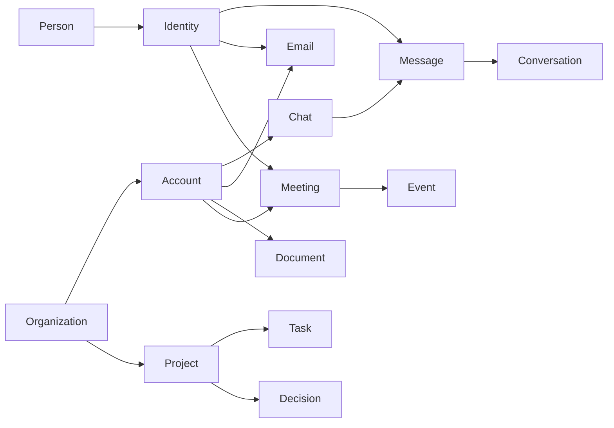

Every WireCat tool — `tg`, `max`, `memo`, `zm` — keeps what it reads in one local SQLite file,
`wirecat.db`. This page is for developers and agent authors who want to query that file or
understand what an agent can find in it. It explains the entities first, then how they connect,
then how a search finds context, and only at the end the columns worth querying by. How the
store is opened, migrated and locked is in [the local store](./architecture.mdx#the-local-store).

It describes the schema as read on 10 October 2026, at a fixed commit of cli-messaging, the
package that owns the file. Every column with its meaning is in the
[schema reference](https://github.com/WireCatLabs/cli-messaging/blob/d874547/docs/storage/schema.md).

## Key entities



In words: a person has identities; identities send messages and emails and take part in
meetings. An organization holds accounts and projects. Each account brings its chats, emails,
documents and meetings; chats hold messages, and messages group into conversations. A meeting
belongs to an event. A project holds tasks and decisions.

### People and identities

A **person** is one human. An **identity** is how one source knows a person: a Telegram
user, a MAX user, an email address, a Zoom participant. One person has many identities;
each identity belongs to at most one person, with the method and confidence of that link kept
beside it. Earlier profiles are kept as revisions. A **bot** is an AI agent or script that
works in the store: it can own projects, take tasks and write notes. A messenger's own bot
account is an identity, not a bot.

### Organizations and projects

An **organization** is a company, team, family or community. A **project** is a place for tasks
with a short key (`MEET`), a type (work, client, personal, open source, other) and an optional
organization. Work accounts and projects belong to an organization; a family is an organization
too.

### Accounts and chats

An **account** is one integration the owner connected: a messenger account, a mailbox, Zoom, a
notes folder. A **chat** belongs to one account. Chats nest: a forum topic sits inside its group,
and a channel's discussion group sits under the channel. A thread is different: it hangs from a
root message inside one chat, as comments under a channel post do.

### Messages and conversations

A **message** belongs to a chat and is sent by an identity. Edits keep the earlier text, and a
message deleted at the source keeps its row without its text. A **conversation** is a group of
messages of one chat that belong to the same discussion, rebuilt from replies, mentions and
the sender continuing ([how they are built](./search-architecture.mdx#3-reconstruct-discussions-with-a-message-graph)).

### Email

An **email** belongs to an email thread and to one account. Its sender and each recipient
(to, cc, bcc) resolve to identities, so mail and messages from the same person meet at one
person. Folders and labels are mailboxes; one email can sit in several.

### Documents, notes and memories

A **document** stands on its own: a file in a notes folder, a page, a wiki page. A **note** is
short text a person or a bot wrote about one thing — a person, a chat, a meeting, a task;
comments on a task are notes. A **memory** is what an agent concluded: a summary, a daily
digest, a fact, a preference. A memory can be wrong, so it always carries its evidence, a
confidence and a status (proposed, confirmed, stale, superseded).

### Events and meetings

An **event** is the owner's record of something that happened, with no provider fields. A
**meeting** is one occurrence as a meeting app recorded it: its participants, transcripts,
in-meeting chat and summaries. A meeting points at its event, so records of the same call from
different sources meet at one event. Repeating events and repeating meetings each have a series.

### Tasks and decisions

A **task** belongs to a project and is named by its key and number (`MEET-12`). Its type is
bug, feature, chore, question, request, mention or promise: a question someone asked is a task of
type question, and a promise someone made is a task of type promise. People and bots are assigned
in a role (assignee, reviewer, watcher), and every change is a task event. A **decision** is a
choice that holds until another replaces it, with its evidence linked.

### Tags and topics

A **tag** is a free label anyone can add. A **topic** is a tag from a short list that only the
owner creates; agents can propose one. A thing can carry many tags and topics, and one topic can
be marked as its main one. A name is either a tag or a topic, never both.

### Proposed and logged actions

A **proposed action** is something an agent wants done outside the store — a reply, a send, a
ban, a new task — waiting for a person to approve or reject it. Nothing external happens without
that approval. Separately, every tool an agent calls is logged with its access tier and target,
without the text of its arguments.

## How they connect

Four tables connect anything to anything, so none of the entities above needs a column for
every other:

- **Links** connect two things with a kind: a question task to the message that `answered-by` it,
  a decision or a memory to its `evidence`, a thing to what it was `created-from`, a task to the
  people, messages, emails and meetings it concerns.
- **Taggings** put a tag or a topic on any thing.
- **Notes** attach a person's text to any thing.
- **Aliases** give any thing other names: a nickname, a contact name in one messenger, a short
  project name. Name matching and search read them.

**Scope** is `personal` or `work`. It is set on accounts, organizations and projects, and what they
hold inherits it: a chat takes its account's scope unless it sets its own, and a memory takes the
scope of its evidence. A question asked for work reads only work data, so it never pulls in a
private chat.

## How search finds context

Finding context for an agent is three steps, in this order.

1. **Narrow with tables.** Person, project, account, time and scope are columns with indexes, so
   the first step is ordinary SQL. The involvement index is the shortcut: one row per person per
   message, email, meeting, task or document they took part in, with their role, the time and the
   scope. "Everything Alice Example did at work this month" is one indexed range.
2. **Match words and meaning over the candidates only.** Each kind of text has its own word and
   stem index: messages, emails, attachments, documents, notes, memories and meetings. Vectors
   then rank by meaning, and every piece of text carries the scope, account, project and time of
   its parent, so the vector scan filters before it compares. How words, stems and vectors work
   is explained in [how search works](./search-architecture.mdx#4-pieces-and-vectors).
3. **Expand along links.** From a hit, follow the reply chain, the conversation it belongs to,
   the thread root, the email thread, or the meeting a transcript row came from, and the links
   that point at it.

```sql
SELECT subject_type, subject_id, role, occurred_at
FROM involvements
WHERE person_id = :person AND scope = 'work' AND occurred_at >= :since
ORDER BY occurred_at DESC
LIMIT 50
```

Vectors belong to long texts: conversations, documents, emails, attachments' text, notes, memories, meeting
transcripts and summaries, events and tasks. A single message never gets its own vector; it is
found by words, or by meaning through its conversation. A text is cut into pieces, and each
piece's vector is stored once per model and text hash, so the same text is never embedded twice.

The involvement index is derived: it is rebuilt from senders, recipients, participants, assignees
and confirmed links, and holds nothing they do not.

## Key columns

Only the columns a reader would filter or join by. Times are epoch milliseconds. A
`<name>_type` and `<name>_id` pair points at a row of any table: `person`, `message`, `task`.

**Sources and people**

| Table | Query by |
| --- | --- |
| `accounts` | `provider`, `scope`, `organization_id` |
| `persons` | `name` |
| `identities` | `provider`, `external_id`, `username`, `name` |
| `identity_links` | `identity_id`, `person_id`, `confidence` |
| `organizations` | `kind`, `scope` |
| `bots` | `name`, `kind`, `owner_person_id` |

**Chats, messages and mail**

| Table | Query by |
| --- | --- |
| `chats` | `account_id`, `kind`, `parent_chat_id`, `scope`, `last_message_at` |
| `messages` | `chat_id`, `sender_identity_id`, `sent_at`, `thread_root_id`, `reply_to_external_id`, `deleted_at` |
| `conversations` | `chat_id`, `first_at`, `last_at` |
| `emails` | `account_id`, `email_thread_id`, `from_identity_id`, `sent_at` |
| `email_recipients` | `email_id`, `identity_id`, `role` |

**Documents, notes and memories**

| Table | Query by |
| --- | --- |
| `documents` | `account_id`, `kind`, `title`, `extension`, `deleted_at` |
| `notes` | `notable_type`, `notable_id`, `author_type`, `author_id` |
| `memories` | `kind`, `subject_type`, `subject_id`, `status`, `scope` |

**Events and meetings**

| Table | Query by |
| --- | --- |
| `events` | `starts_at`, `event_series_id` |
| `meetings` | `account_id`, `event_id`, `started_at`, `host_identity_id` |
| `meeting_participants` | `meeting_id`, `identity_id`, `role` |
| `meeting_transcript_rows` | `meeting_transcript_id`, `speaker_participant_id`, `start_ms` |

**Tasks, decisions and actions**

| Table | Query by |
| --- | --- |
| `projects` | `key`, `type`, `organization_id`, `scope` |
| `tasks` | `project_id`, `key`, `type`, `status`, `due_at`, `parent_id` |
| `task_assignments` | `task_id`, `assignee_type`, `assignee_id`, `role` |
| `decisions` | `project_id`, `status`, `decided_at`, `supersedes_id` |
| `proposed_actions` | `status`, `kind`, `target_type`, `target_id` |

**Connections and search**

| Table | Query by |
| --- | --- |
| `links` | `from_type`, `from_id`, `to_type`, `to_id`, `kind` |
| `taggings` | `tag_id`, `taggable_type`, `taggable_id`, `main` |
| `tags` | `name`, `kind` |
| `aliases` | `aliasable_type`, `aliasable_id`, `name_folded` |
| `involvements` | `person_id`, `identity_id`, `occurred_at`, `scope`, `subject_type`, `subject_id` |
| `chunks` | `chunkable_type`, `chunkable_id`, `scope`, `occurred_at`, `content_hash` |
| `embeddings` | `model`, `content_hash` |

<details id="conventions" className="docs-disclosure">
<summary>Naming conventions and every table</summary>

- Tables are plural and snake_case. The primary key is `id`; a foreign key is `<singular>_id`.
- `external_id` is the source's own id for a row; another thing's source id is
  `<thing>_external_id`.
- `created_at` and `updated_at` say when the row was saved and changed in this file. Times in the
  world keep their own names: `sent_at`, `joined_at`, `started_at`, `due_at`.
- `deleted_at` means gone at the source. Sync never removes a row; only an owner command does.
- A pointer to a row of any table is a `<name>_type` text, the singular table name, and a
  `<name>_id` integer. Who made or owns something is a `person` or a `bot`.
- What is searched has its own column; `metadata` is JSON for what is not.
- Flags have no `is_` prefix. Times are integers in epoch milliseconds.
- Every foreign key and every `_type`/`_id` pair has an index.

Every table and its columns, by area:

**Sources**

| Table | Columns |
| --- | --- |
| `accounts` | `id`, `provider`, `external_id`, `name`, `created_at`, `settings`, `status`, `updated_at`, `scope`, `organization_id` |
| `sync_cursors` | `account_id`, `key`, `value`, `updated_at`, `created_at` |
| `sync_ranges` | `chat_id`, `from_key`, `to_key`, `created_at`, `updated_at` |
| `fetch_leases` | `chat_id`, `anchor`, `holder`, `expires_at` |
| `bot_updates` | `id`, `account_id`, `external_id`, `kind`, `payload`, `received_at`, `handled_at`, `error`, `replayed_at`, `created_at` |
| `syncs` | `id`, `account_id`, `kind`, `started_at`, `finished_at`, `status`, `counts`, `error`, `created_at`, `updated_at` |

**People, organizations and bots**

| Table | Columns |
| --- | --- |
| `persons` | `id`, `name`, `owner`, `created_at`, `updated_at` |
| `identities` | `id`, `provider`, `external_id`, `username`, `name`, `bot`, `phone_hmac`, `metadata`, `created_at`, `updated_at`, `description` |
| `identity_links` | `identity_id`, `person_id`, `method`, `confidence`, `created_at`, `author`, `source`, `updated_at` |
| `identity_link_events` | `id`, `identity_id`, `from_person_id`, `to_person_id`, `method`, `created_at`, `author` |
| `identity_revisions` | `id`, `identity_id`, `name`, `username`, `description`, `marks`, `created_at` |
| `account_identities` | `account_id`, `identity_id`, `created_at`, `last_messaged_at`, `updated_at` |
| `aliases` | `id`, `aliasable_type`, `aliasable_id`, `account_id`, `name`, `name_folded`, `display`, `source`, `created_at`, `updated_at` |
| `identities_fts` | full-text index over `name`, `username` |
| `organizations` | `id`, `kind`, `name`, `scope`, `metadata`, `created_at`, `updated_at`, `deleted_at` |
| `bots` | `id`, `name`, `kind`, `description`, `owner_person_id`, `model`, `token_digest`, `last_seen_at`, `disabled_at`, `metadata`, `created_at`, `updated_at` |

**Chats and messages**

| Table | Columns |
| --- | --- |
| `chats` | `id`, `account_id`, `external_id`, `kind`, `title`, `unread_count`, `last_message_at`, `participants_count`, `metadata`, `updated_at`, `username`, `membership_state`, `searchable`, `message_count`, `members_tracked_at`, `description`, `details_fetched_at`, `created_at`, `parent_chat_id`, `scope` |
| `chat_members` | `chat_id`, `identity_id`, `created_at` |
| `member_stays` | `id`, `chat_id`, `identity_id`, `first_seen_at`, `last_seen_at`, `joined_at`, `invited_by_identity_id`, `role`, `left_at`, `created_at`, `updated_at` |
| `member_counts` | `chat_id`, `date`, `reported_count`, `listed_count`, `complete_list`, `created_at` |
| `messages` | `id`, `chat_id`, `account_id`, `external_id`, `thread_external_id`, `sender_identity_id`, `sender_chat_external_id`, `sender_name`, `sent_at`, `edited_at`, `deleted_at`, `text`, `reply_to_external_id`, `reply_to`, `forward`, `outgoing`, `reactions`, `metadata`, `created_at`, `source`, `normalized_text`, `normalizer_version`, `mentions`, `updated_at`, `thread_root_id` |
| `message_revisions` | `id`, `message_id`, `text`, `edited_at`, `created_at` |
| `message_links` | `id`, `chat_id`, `message_id`, `parent_id`, `source`, `kind`, `confidence`, `method`, `version`, `batch`, `build`, `created_at`, `stale_at`, `updated_at` |
| `message_counter_observations` | `message_id`, `counter`, `value`, `created_at`, `source` |
| `message_transcripts` | `id`, `message_id`, `chat_id`, `message_external_id`, `text`, `source`, `heard_at`, `created_at`, `updated_at` |
| `chats_fts` | full-text index over `title` |
| `messages_fts` | full-text index over `text` |
| `message_words` | full-text index over `normalized_text`, `scope` |
| `message_stems` | full-text index over `stems`, `scope` |
| `message_stems_pending` | `id` |
| `member_observations` | `id`, `chat_id`, `observed_at`, `started_at`, `complete`, `reported_count`, `listed_count`, `source`, `created_at`, `updated_at` |
| `member_observation_members` | `member_observation_id`, `identity_id`, `member_stay_id` |

**Mail**

| Table | Columns |
| --- | --- |
| `email_threads` | `id`, `account_id`, `external_id`, `subject`, `last_email_at`, `emails_count`, `metadata`, `created_at`, `updated_at`, `deleted_at` |
| `emails` | `id`, `account_id`, `email_thread_id`, `external_id`, `subject`, `from_identity_id`, `from_address`, `from_name`, `sent_at`, `received_at`, `in_reply_to`, `references`, `body_text`, `body_html`, `snippet`, `outgoing`, `read`, `flagged`, `draft`, `size`, `headers`, `metadata`, `created_at`, `updated_at`, `deleted_at` |
| `email_recipients` | `id`, `email_id`, `identity_id`, `address`, `name`, `role`, `position`, `created_at`, `updated_at` |
| `mailboxes` | `id`, `account_id`, `external_id`, `name`, `kind`, `created_at`, `updated_at` |
| `email_mailboxes` | `email_id`, `mailbox_id`, `created_at` |
| `email_words` | full-text index over `normalized_text`, `scope` |
| `email_stems` | full-text index over `stems`, `scope` |
| `email_index_pending` | `id`, `indexable_type` |

**Attachments**

| Table | Columns |
| --- | --- |
| `attachments` | `id`, `attachable_type`, `attachable_id`, `position`, `kind`, `mime`, `name`, `title`, `url`, `size`, `width`, `height`, `duration`, `provider_ref`, `local_path`, `text`, `normalized_text`, `extraction`, `extractor`, `extraction_error`, `content_sha256`, `extracted_at`, `created_at`, `updated_at` |
| `attachment_words` | full-text index over `normalized_text` |

**Documents, notes and memories**

| Table | Columns |
| --- | --- |
| `documents` | `id`, `account_id`, `external_id`, `kind`, `title`, `location`, `file_name`, `extension`, `url`, `storage`, `local_path`, `mime`, `size`, `content_hash`, `front_matter`, `body`, `normalized_text`, `extraction`, `extraction_error`, `language`, `revision`, `export_path`, `external_created_at`, `external_updated_at`, `metadata`, `created_at`, `updated_at`, `deleted_at` |
| `document_revisions` | `id`, `document_id`, `body`, `revision`, `created_at` |
| `document_words` | full-text index over `normalized_text`, `scope` |
| `document_stems` | full-text index over `stems`, `scope` |
| `document_index_pending` | `id`, `indexable_type` |
| `notes` | `id`, `notable_type`, `notable_id`, `title`, `body`, `author_type`, `author_id`, `revision`, `created_at`, `updated_at`, `deleted_at` |
| `note_revisions` | `id`, `note_id`, `body`, `revision`, `created_at` |
| `note_words` | full-text index over `normalized_text`, `scope` |
| `note_stems` | full-text index over `stems`, `scope` |
| `note_index_pending` | `id`, `indexable_type` |
| `memories` | `id`, `kind`, `body`, `subject_type`, `subject_id`, `author_type`, `author_id`, `model`, `confidence`, `status`, `last_verified_at`, `supersedes_id`, `scope`, `created_at`, `updated_at` |
| `memory_words` | full-text index over `normalized_text`, `scope` |
| `memory_stems` | full-text index over `stems`, `scope` |
| `memory_index_pending` | `id`, `indexable_type` |

**Events and meetings**

| Table | Columns |
| --- | --- |
| `event_series` | `id`, `title`, `recurrence`, `origin`, `created_at`, `updated_at` |
| `events` | `id`, `event_series_id`, `title`, `description`, `location`, `starts_at`, `ends_at`, `timezone`, `origin`, `created_at`, `updated_at`, `deleted_at` |
| `meeting_series` | `id`, `account_id`, `external_id`, `event_series_id`, `title`, `description`, `kind`, `recurrence`, `host_identity_id`, `join_url`, `metadata`, `created_at`, `updated_at`, `deleted_at` |
| `meetings` | `id`, `account_id`, `meeting_series_id`, `event_id`, `external_id`, `title`, `description`, `location`, `join_url`, `started_at`, `ended_at`, `duration_ms`, `timezone`, `host_identity_id`, `participants_count`, `metadata`, `created_at`, `updated_at`, `deleted_at` |
| `meeting_participants` | `id`, `meeting_id`, `identity_id`, `display_name`, `email`, `role`, `joined_at`, `left_at`, `duration_ms`, `sessions`, `external_id`, `metadata`, `created_at`, `updated_at` |
| `meeting_transcripts` | `id`, `meeting_id`, `source`, `format`, `language`, `content_hash`, `external_created_at`, `superseded_at`, `metadata`, `created_at`, `updated_at`, `deleted_at` |
| `meeting_transcript_rows` | `id`, `meeting_transcript_id`, `position`, `start_ms`, `end_ms`, `speaker_participant_id`, `speaker_name`, `text`, `normalized_text`, `metadata`, `created_at` |
| `meeting_chat_messages` | `id`, `meeting_id`, `external_id`, `sent_at`, `sender_participant_id`, `sender_name`, `recipient`, `text`, `normalized_text`, `metadata`, `created_at`, `updated_at` |
| `meeting_summaries` | `id`, `meeting_id`, `source`, `title`, `overview`, `sections`, `next_steps`, `content`, `doc_url`, `external_created_at`, `external_updated_at`, `metadata`, `created_at`, `updated_at` |
| `meeting_words` | full-text index over `normalized_text`, `scope` |
| `meeting_stems` | full-text index over `stems`, `scope` |
| `meeting_index_pending` | `id`, `indexable_type` |

**Tasks**

| Table | Columns |
| --- | --- |
| `reminders` | `id`, `task_id`, `account_id`, `due_at`, `timezone`, `state`, `revision`, `lease_until`, `receipt`, `created_at`, `updated_at` |
| `projects` | `id`, `key`, `name`, `description`, `type`, `organization_id`, `account_id`, `scope`, `owner_type`, `owner_id`, `tasks_count`, `status`, `created_at`, `updated_at`, `deleted_at` |
| `tasks` | `id`, `project_id`, `number`, `key`, `title`, `description`, `type`, `status`, `priority`, `parent_id`, `due_at`, `started_at`, `closed_at`, `closed_by_type`, `closed_by_id`, `close_reason`, `author_type`, `author_id`, `source`, `package_id`, `source_locator`, `source_kind`, `source_group`, `resolution`, `verdict`, `metadata`, `created_at`, `updated_at`, `deleted_at` |
| `task_assignments` | `id`, `task_id`, `assignee_type`, `assignee_id`, `role`, `created_at`, `updated_at` |
| `task_events` | `id`, `task_id`, `actor_type`, `actor_id`, `kind`, `changes`, `created_at` |
| `decisions` | `id`, `project_id`, `statement`, `status`, `decided_at`, `supersedes_id`, `confirmed_by_type`, `confirmed_by_id`, `source`, `metadata`, `created_at`, `updated_at`, `deleted_at` |

**Agents and actions**

| Table | Columns |
| --- | --- |
| `proposed_actions` | `id`, `kind`, `account_id`, `target_type`, `target_id`, `payload`, `reason`, `status`, `proposed_by_type`, `proposed_by_id`, `decided_by_type`, `decided_by_id`, `decided_at`, `executed_at`, `result`, `error`, `verdict`, `created_at`, `updated_at` |
| `agent_actions` | `id`, `actor_type`, `actor_id`, `tool`, `tier`, `target_type`, `target_id`, `status`, `error`, `started_at`, `finished_at`, `created_at` |

**Tags, links and saved searches**

| Table | Columns |
| --- | --- |
| `tags` | `id`, `name`, `kind`, `created_at`, `updated_at` |
| `auto_tag_claims` | `chat_id`, `tag_id`, `algorithm`, `score`, `fields`, `created_at`, `updated_at` |
| `links` | `id`, `from_type`, `from_id`, `to_type`, `to_id`, `kind`, `anchor`, `source`, `target_text`, `target_folded`, `role`, `evidence`, `metadata`, `confirmed`, `created_at`, `author`, `updated_at` |
| `searches` | `id`, `name`, `command`, `params`, `language`, `version`, `fields_version`, `created_at`, `last_run_at`, `runs`, `updated_at` |
| `taggings` | `id`, `tag_id`, `taggable_type`, `taggable_id`, `main`, `source`, `author_type`, `author_id`, `created_at`, `updated_at` |

**Pieces, vectors and search state**

| Table | Columns |
| --- | --- |
| `conversations` | `id`, `chat_id`, `first_message_id`, `build`, `first_at`, `last_at`, `message_count`, `built_at`, `algorithm_version`, `created_at`, `updated_at` |
| `conversation_messages` | `conversation_id`, `message_id` |
| `conversation_state` | `chat_id`, `enabled_at`, `built_at`, `algorithm_version`, `current_build` |
| `conversation_chunks` | `conversation_id`, `ordinal`, `first_message_id`, `last_message_id`, `content_hash`, `text_start`, `text_end` |
| `embeddings` | `model`, `content_hash`, `dims`, `vector`, `created_at`, `updated_at` |
| `search_index_state` | `name`, `watermark`, `filled_through`, `terms_through`, `normalizer_version`, `built_at`, `analyzer` |
| `search_terms` | `term`, `length` |
| `search_term_trigrams` | `trigram`, `length`, `term` |
| `involvements` | `id`, `person_id`, `identity_id`, `subject_type`, `subject_id`, `role`, `occurred_at`, `scope`, `account_id`, `project_id`, `created_at` |
| `chunks` | `id`, `chunkable_type`, `chunkable_id`, `position`, `start_offset`, `end_offset`, `content_hash`, `scope`, `account_id`, `project_id`, `occurred_at`, `created_at`, `updated_at` |

**The file**

| Table | Columns |
| --- | --- |
| `schema_migrations` | `version`, `min_compatible`, `applied_at` |
| `store_settings` | `key`, `value`, `at` |

The [schema reference](https://github.com/WireCatLabs/cli-messaging/blob/d874547/docs/storage/schema.md)
lists every column, constraint and index.

</details>

To see these tables at work, read [how search works](./search-architecture.mdx); to see how the
store fits into the tools, read [architecture](./architecture.mdx).
