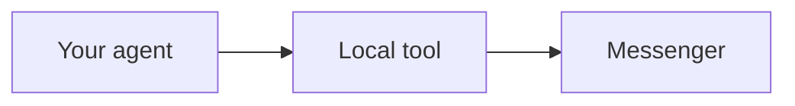

# Documentation tools for people and agents

Read [AUTHORING.md](AUTHORING.md) for writing decisions, [TERMINOLOGY.md](TERMINOLOGY.md)
for reader terms, [REVIEWING.md](REVIEWING.md) for the review workflow and [README.md](README.md)
for page ownership. These commands run from the cli-docs checkout. Their generated files stay in ignored
`.docs-tooling/`, separate from maintained documentation and real messenger state.

## Gather source with Repomix

```sh
pnpm docs:pack --repo site --topic search
pnpm docs:pack --repo max --ref v0.27.0 --topic login
pnpm docs:pack --repo messaging --ref v0.140.0 --topic replies
```

Repositories are `site`, `tg`, `max`, `core` and `messaging`; the latter four use sibling local
checkouts. Topics are optional: `login`, `search`, `replies`. `--ref` selects a fixed Git commit/tag;
without it the pack describes the current working tree, including allowed untracked source.
Use `tools.json` and the selected release's package manifest for current refs and dependencies;
the example refs above reflect the initial pilot, not an instruction to keep outdated versions.

The wrapper enumerates files before reading them, rejects protected/private paths and symlinks
to disallowed targets, stages permitted source, and runs Repomix only on that snapshot. It records
the revision, per-file hashes, file sizes and Repomix version in `manifest.json`. Every run creates
a distinct pack so concurrent agents cannot overwrite each other's snapshots.

Each pack contains `source.xml`, a `source/` directory and its manifest. Give another agent the
path plus the concrete question; do not insert a whole repository pack into every conversation.
Topic filters are filename-based and omit dependencies outside the selected files. Use source
reads for exact behavior. Optional `--compress` reduces context but can omit implementation detail.
The wrapper never uploads the pack; a subsequent AI workflow uses its selected provider.

## Check released commands and coverage

```sh
pnpm sync
pnpm docs:contracts
pnpm docs:check
pnpm docs:release-notes
pnpm docs:quality
```

`docs:contracts` installs each exact reviewed npm release into an isolated directory with lifecycle
scripts disabled. It captures only `commands --json`, with temporary tool/XDG paths and a Node
preloader blocking network and keyring sockets. It records package version, Git head, integrity,
dependencies and a discovery hash. It does not log in or read account data.

`docs:check` runs scoped Markdown lint and strict release validation. It rejects missing command
reference entries/options, invalid command examples and missing task destinations. It checks
authored shared pages, synced localized tool guides and the homepage fixtures used in Demo, including inline command mentions and
shell/PowerShell fences. It never executes an example. A stale or missing contract is an error.

Inspect `.docs-tooling/reports/quality.json` for four distinct results:

- **References:** released command paths and their own options in generated command sections.
- **Examples:** invalid invocations, syntax illustrations, and constructs needing manual review.
- **Tasks:** reviewed mappings in `docs/tasks.json` and missing destination files.
- **Unmapped families:** command families with no task mapping yet. Some need a better section or
  link; others need only reference coverage. This report never demands one guide per command.

The checker handles profiles, quoted arguments, flags, arity exposed by the command tree,
continuations, redirection and multiple invocations in pipelines/conditional chains. Inline
references may name a command without supplying its required values. Generic subcommand
placeholders and shell globs are reported for review, not claimed as validated. It cannot prove
runtime success, implicit environment behavior, option relationships or factual prose claims.

## Markdown, spelling and diagrams

```sh
pnpm docs:lint
pnpm docs:spell
pnpm docs:localize
pnpm build
pnpm check:links
pnpm check:seo
PLAYWRIGHT_EXPORT=1 pnpm exec playwright test tests/documentation-diagrams.spec.ts
```

Markdown lint checks tabs, excessive blank lines, fence languages and empty links. It does not
require generic headings, a minimum length or a fixed page template. Heading-depth lint is
disabled because MDX Steps supply structure that the plain Markdown parser cannot see.
Spelling is an editorial report with EN/RU/ES dictionaries; technical and inflected words still
need review. It is not a CI blocker. Review genuine typos before adding dictionary exceptions.

Use fenced `mermaid` with a caption after the language:

````md

````

The site uses beautiful-mermaid to render SVG during the build, with theme variables and unique
IDs. A caption and adjacent prose provide an equivalent explanation. Markdown twins retain the
source fence. Unsupported diagram syntax fails rendering instead of silently publishing no
diagram. Localization permits translated flowchart labels/captions while checking node IDs,
shapes, edges and other graph structure; executable fences remain exact. Other diagram families
must pass the existing parser/renderer before using translated labels.

## Run the CodeWiki comparison

Install the pinned upstream source and isolated Python environment:

```sh
pnpm docs:wiki:install
```

Create released topic packs first, then run:

```sh
pnpm docs:wiki --topic login
pnpm docs:wiki --topic search
pnpm docs:wiki --topic replies
pnpm docs:wiki:review
```

The initial wrappers select MAX login and the shared messaging search/reply implementation.
They use the existing Codex login and its default model, without changing global CodeWiki or
Codex settings, reading dotenv files, or configuring a keyring. Each run supplies at most ten
relevant source files, limits depth/agent requests, and writes a source manifest, draft pages and
a measured result separately. This is a partial-source experiment, not a complete repository wiki.

Run `docs:wiki:review` to check input hashes and citation file/ranges. A passing range check
does not prove the claim it cites. Inspect claims and source references against the supplied files. Record errors, omissions,
useful discoveries and editing effort before adapting any content. Subscription limits, provider
availability and missing imported modules may prevent completion; retain those results rather
than claiming success. For wider generation, change the trial scope deliberately and keep its
inputs/output isolated. Installation requires Git, Node/npm and uv with Python 3.12 support.

## Shared agent workflow

The reusable skill lives at `skills/wirecat-documentation/SKILL.md`. Its installed copies in the
owner's shared `.agents/skills` and Claude `.claude/skills` directories point agents back to these
maintained rules. Refresh those copies after editing the skill. A TypeScript LSP is not installed:
semantic navigation requires a compatible client integration; this work uses existing TypeScript
checks and targeted source searches without changing the project's compiler version.


## Release-note and roadmap review

`pnpm docs:release-notes` runs after sync in CI and production documentation deployment. It
requires the pinned version to be the newest released changelog entry with substantive notes,
and requires a versioned roadmap review in `docs/release-notes-review.json`. Changing the version
or roadmap invalidates that record. The reviewer removes already-shipped work from future
plans or records that plans are unchanged, then stores the source fingerprint and conclusion.
Preview builds from an explicit nonrelease ref use the existing preview path. This is a portal
publication gate; the CLI repositories keep their own separate publish checks.

## Synthetic report example

After capturing the reviewed packages with `pnpm docs:contracts`, run
`pnpm docs:report-fixture` to check the report example against both released dependencies. It uses
a new synthetic SQLite store and fixed clock, with no messenger connection. The JSON evidence
is saved under `.docs-tooling/reports/approved-proposals/`. A complete stored reply graph must
not be interpreted as complete archive coverage.

## Current-version reader guides

`pnpm docs:versions` checks public guides for package release-number prose and pinned package
installation commands. It runs within `pnpm docs:check`. Changelog and roadmap history, immutable
source URLs, local addresses and runtime prerequisites are excluded. Native-page wording is
adjusted through explicit corrections so a release sync cannot silently reintroduce old text.

The same current-guide check rejects recognized editorial artifacts: old-command update hedges,
owner test confirmations and public “what was checked” notes. It does not reject factual
prerequisites or symptom-based troubleshooting. Keep review evidence in `docs/reviews/`.
