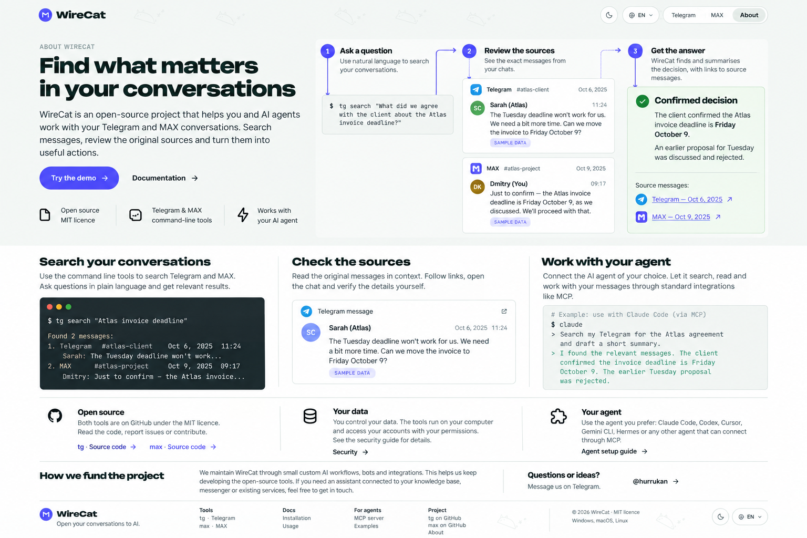
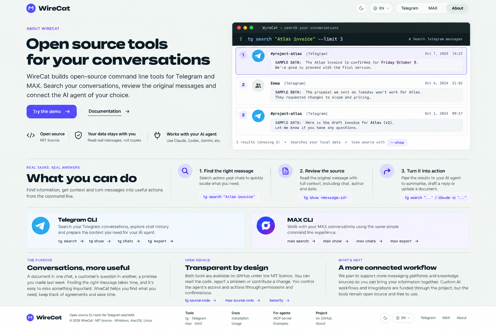
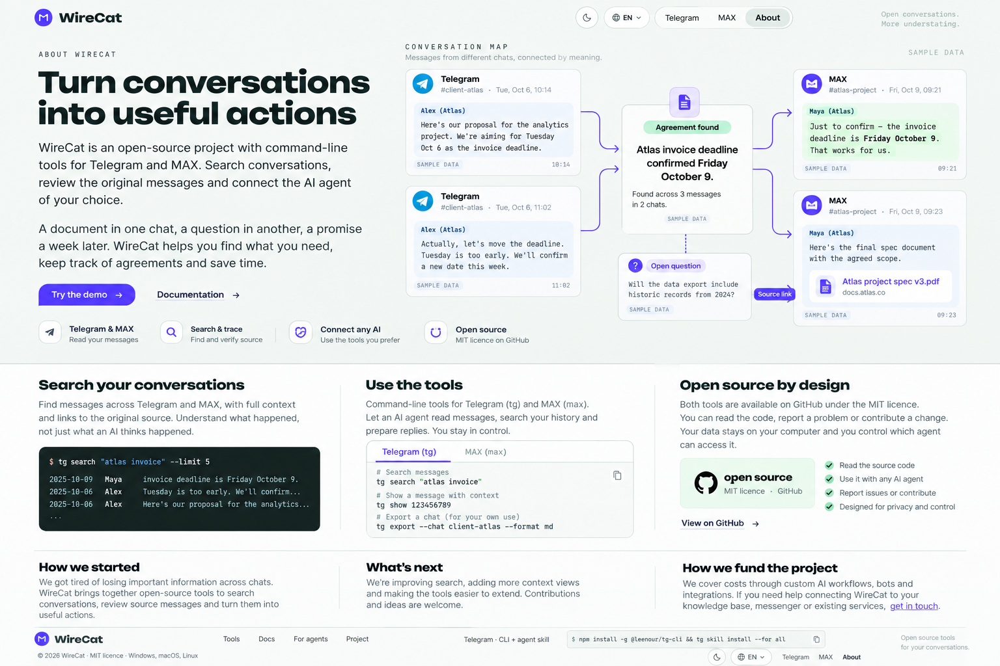

# WireCat homepage concepts

Three visual concepts generated on 7 October 2026. They were proposed for About; the owner liked the visual direction and asked to keep them for a future **homepage** redesign instead.

These are PNG mockups, not implemented web pages. No corresponding HTML, React components or CSS exist yet. Each image has a sibling `.prompt.json` with its exact generation prompt and provenance. The homepage is unchanged by this archive.

## Guided task

A question leads through source messages to an answer.

[Generation prompt](guided-task.prompt.json)

## Product in action

A compact product introduction beside terminal output and sample search results.

[Generation prompt](product-in-action.prompt.json)

## Conversation map

Message excerpts connect to a decision, an open question and a source.

[Generation prompt](conversation-map.prompt.json)

## Before implementation

Treat these as composition references. Verify copy, dates, commands, links and product claims against the current CLI before building. The mockups contain placeholder command paths and sample text; the conversation map is an illustrative agent workflow, not a promised native cross-chat knowledge graph. Do not copy the mockups' privacy wording without checking how local archives and model providers work.

The incumbent About implementation used as the visual reference is [page.tsx](https://github.com/WireCatLabs/cli-docs/blob/f1ee709dc3992f1c27f2cafac3339efca504ee51/app/%5Blang%5D/(home)/about/page.tsx), [about.css](https://github.com/WireCatLabs/cli-docs/blob/f1ee709dc3992f1c27f2cafac3339efca504ee51/lib/landing/about.css) and [about.ts](https://github.com/WireCatLabs/cli-docs/blob/f1ee709dc3992f1c27f2cafac3339efca504ee51/lib/about.ts).
