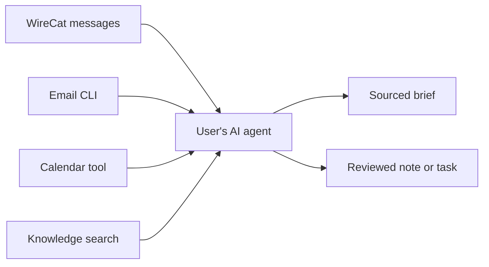

# WireCat productivity integrations and product directions

Research date: 3 October 2026. Scope: functionality, user value, existing solutions, and incremental development. Pricing and monetization are outside this report.

The recommended direction is to make WireCat a dependable source of personal conversation context for the tools and AI agents a user already has. Start with meeting preparation, saving decisions into an existing knowledge base, and tracking commitments across messages and email. A productivity suite can emerge from these working connections without requiring a new application for every function.

This recommendation is a product hypothesis. The research below establishes documented capabilities and integration routes; it does not establish demand, market share, or comparative answer quality. Third-party tools were researched through their maintainers' documentation and repositories, rather than installed or benchmarked. Repository documentation establishes WireCat's described capabilities, with narrower verification evidence noted below. The user confirmed that the email CLI they had in mind is Himalaya.

## What WireCat already contributes

The current [product definition](../../PRODUCT.md) targets developers who already use AI agents and need help with Telegram and MAX. The [archive documentation](../../translations/tg/archive.ru.md) describes a shared local SQLite store, resumable history fetching, account and provider aware search, explicit history completeness, JSONL and Markdown exports, and database backup and restore. It also describes conversation reconstruction, local semantic search over conversations, and source locators for retrieving message context.

WireCat therefore already contributes more than a collection of message API calls. It combines access to the owner's account with a retained archive and interfaces intended for agents. External knowledge search would extend this foundation; it does not require replacing the existing conversation search.

One limitation matters when discussing capability: stored history is the history actually fetched or observed. An empty search result cannot prove that a conversation never happened. The [published CLI contract checks](../agent-evals/real-cli-contract.md) verify selected offline behavior using synthetic data, including source retrieval and incomplete coverage; they do not establish production ingestion quality or superiority over competitors.

The next integration should help answer a recurring question, such as: “What changed since my last meeting with this person?” or “What did I promise, and is it still outstanding?” Adding another storage destination without a useful answer is a weaker development objective.

## How to think about personal productivity

There are several different jobs hidden inside the phrase “second brain”:

| Job | What the user needs | Potential contribution from messages |
| --- | --- | --- |
| Capture and recall | Find information without remembering where it was saved | Search conversations, attachments, recommendations, and voice notes |
| Prepare and decide | Reconstruct the current situation before a meeting or decision | Combine recent discussions with email, documents, and meeting notes |
| Follow through | Keep promises, notice dependencies, and chase missing answers | Extract commitments and check subsequent messages for changes |
| Maintain knowledge | Preserve useful decisions and explanations beyond a chat thread | Publish selected, sourced notes into an existing project knowledge base |
| Maintain relationships | Remember previous interactions and reasons to reconnect | Assemble a person or company timeline across channels |
| Preserve information | Recover an archive after a device failure or move | Export and back up the retained data |

These are proposed user jobs, not findings about how often each occurs. They also explain why a notes application and a task manager are complementary. In GTD, captured material must be clarified into actions, reference information, or other categories, then reviewed. PARA organizes information around projects, areas, resources, and archives. Both approaches make the use of captured information central. [GTD fundamentals](https://gettingthingsdone.com/what-is-gtd/), [Forte Labs on project based organization](https://fortelabs.com/blog/the-box-twyla-tharp-on-project-based-organizing/).

For WireCat, the useful connection is often “conversation → project decision” or “conversation → next action.” Automatically copying every message into a notes app can create another inbox that needs maintenance.

### What the evidence says about entrepreneurs and executives

This research did not find representative evidence that establishes a ranked tool stack for CEOs, or how many executives build their own productivity systems with coding agents. Public examples should inform experiments, rather than define an entire customer segment.

There is a concrete relevant example: Shopify CEO Tobi Lütke maintains QMD, a local search tool for documents, knowledge bases, and meeting notes. His GitHub profile links his personal site and the project. This supports the existence of the modular workflow the user described, but does not show how widely CEOs use it. [Lütke's profile](https://github.com/tobi), [his biography](https://tobi.lutke.com/pages/about), [QMD repository](https://github.com/tobi/qmd).

There is broader evidence of communication overload. Microsoft's 2025 study reports 275 daily pings for the top 20% of users by received ping volume, measured over a 24-hour day. Its telemetry excludes EU and education tenants. This is evidence about a heavily interrupted group, not the average CEO or all knowledge workers. [Microsoft's report and methodology](https://www.microsoft.com/en-us/worklab/work-trend-index/breaking-down-infinite-workday).

My recommended initial segment is a technical founder, consultant, or operator who already uses an agent and conducts substantial work in Telegram plus email. “Uses Telegram for consequential work and repeatedly rebuilds context” is a more useful recruitment criterion than “is a CEO.” Large-company executives may introduce assistant delegation, organization permissions, and team workflows that the current CLI audience does not yet require.

## Existing products and the overlap with WireCat

These are the most relevant products to examine for this decision, not an adoption ranking. The documented features below are sourced; the implications for WireCat are my assessment.

| Product or category | Documented functionality | Implication for WireCat |
| --- | --- | --- |
| **Beeper** | Local desktop API and MCP for personal messaging networks, including Telegram; message search and send or draft operations. The desktop app must run, and available history can be limited. [Developer documentation](https://developers.beeper.com/desktop-api/) | The closest competitor to agent access across personal chats. A local API and MCP alone do not differentiate WireCat. Compare archival coverage, unattended operation, and reproducibility. It could also supply additional networks through an optional adapter. |
| **Read AI** | Ask Read searches meeting reports and connected email, calendars, Slack or Teams, cloud storage, documentation, and CRM systems. [Ask Read documentation](https://support.read.ai/hc/en-us/articles/39009378777875-Using-Ask-Read-to-search-your-meetings-and-connected-apps) | Much of the proposed context assistant already exists as SaaS. Telegram and MAX are not listed on this documented integration surface; that is an opening to investigate, not proof of a permanent gap. |
| **Notion AI** | Enterprise Search answers questions across Notion and connected apps with citations. A personal Gmail connector searches the connected inbox; its documentation currently excludes attachments. [Enterprise Search](https://www.notion.com/help/enterprise-search), [personal Gmail connector](https://www.notion.com/help/notion-mail-ai-connector) | Notes plus email context already exist. Position WireCat around additional conversation sources, archive control, and useful workflows. Notion can be a destination and context provider as well as a competitor. |
| **Glean** | Connectors ingest content and source permissions; documented access patterns include indexed, live, and hybrid retrieval. [Connector architecture](https://docs.glean.com/connectors/about) | A strong reference for organization knowledge search. A personal CLI can focus on a smaller setup and owner controlled data. Team search would introduce a substantially larger product scope. |
| **ChatGPT and Codex** | Plugins connect tools and data through skills and MCP, including Gmail, Drive, and Slack examples. [Official OpenAI documentation](https://learn.chatgpt.com/docs/plugins) | Existing assistants are both distribution surfaces and substitutes for a custom assistant interface. Supplying reliable missing data may be more valuable than building another chat screen. |
| **Gemini** | Connected apps can retrieve Gmail and Drive information, summarize Google Chat, and work with tasks, notes, and calendar events, subject to account availability. [Google documentation](https://support.google.com/gemini/answer/14959807?hl=en) | A broad Google productivity assistant already exists. WireCat can complement it with conversation sources outside that ecosystem. |
| **Microsoft Copilot in Outlook** | Supports questions about inbox, calendar, and meetings, with functionality depending on account and license. [Microsoft documentation](https://support.microsoft.com/en-us/outlook/copilot-outlook/chat-with-copilot-in-outlook) | Email summaries and calendar assistance are established functionality. Building a generic email assistant from scratch would duplicate substantial existing work. |
| **Superhuman Mail** | Its MCP documentation includes morning triage, meeting preparation, open commitments, contextual drafts, and workflows combining meeting notes and CRM data. [MCP use cases](https://help.superhuman.com/hc/en-us/articles/46005872462605-Superhuman-Mail-MCP-Use-Cases) | A particularly relevant benchmark for email workflows and modular composition. WireCat should add the messaging history those workflows lack. |
| **Mem** | Mem Agent brings back information from captured notes and calendar context to support follow-through. Mem MCP can read, create, search, and organize notes and collections. [Mem Agent](https://get.mem.ai/product/agent), [MCP documentation](https://docs.mem.ai/mcp/overview) | Proactive personal memory is already a product category. Mem is also a possible destination for selected conversation knowledge. |
| **Granola** | MCP exposes meeting notes, transcript search, action items, and decisions within documented access limits. [Granola MCP](https://help.granola.ai/article/granola-mcp) | Integrating existing meeting context is a smaller step than building recording and transcription for meetings. |
| **Attio and Dex** | Attio derives relationship information from synchronized email and calendar. Dex also provides Google email and calendar context around contacts. [Attio sync](https://attio.com/help/reference/email-calendar/email-and-calendar-syncing), [Dex Google sync](https://getdex.com/docs/integrationsandfeatures/syncfeatures/sync-google) | Relationship history is established territory. Telegram context could complement an existing CRM before WireCat attempts a personal CRM interface. |
| **Akiflow and Motion** | Akiflow consolidates tasks from existing services with calendars. Motion schedules and reprioritizes tasks around availability and deadlines. [Akiflow integrations](https://akiflow.com/integrations), [Motion task manager](https://www.usemotion.com/features/ai-task-manager) | Deliver good commitments into these systems. Calendar planning is a different specialization from discovering what was agreed in conversations. |
| **OpenClaw** | A personal assistant gateway with memory and tools, running on the user's hardware. Its standard Telegram channel uses a bot token. [Repository](https://github.com/openclaw/openclaw), [channel setup](https://docs.openclaw.ai/channels) | An agent runtime can consume WireCat. Talking to an assistant through Telegram is a different capability from reading the owner's existing account history. |

The answer to “does SaaS already cover this?” is **yes, substantial parts**. There are also local solutions. The remaining question is whether WireCat can deliver a particular workflow better for a particular user. Documentation cannot establish that competitors are inaccurate or inconvenient; comparative testing must.

### Where WireCat could compete

The strongest candidates are dependable history retrieval, explicit disclosure of missing history, offline recall, conversation reconstruction, source verification, and use across agents. These are areas in which WireCat has described capabilities and can measure performance. They are not established exclusive advantages.

Useful comparison tasks include finding an agreement from an old conversation, noticing a later reversal, identifying a promise resolved in another channel, and retrieving the exact source behind a summary. These tests matter more than comparing connector counts.

## Integrations to prioritize

The priorities and effort assessments are recommendations. Effort is relative to the smallest useful workflow; it is not an estimate for a complete production connector.

| Integration | Smallest valuable workflow | Reuse route | Priority and scope |
| --- | --- | --- | --- |
| **Email** | Combine a chat discussion and an email thread into one sourced account or project brief | [Himalaya](https://github.com/pimalaya/himalaya) for multiple email backends; [gog](https://github.com/openclaw/gogcli) or [gws](https://github.com/googleworkspace/cli) for Google accounts | First. Start with selected recent threads, rather than importing an entire mailbox. |
| **Calendar** | Identify tomorrow's meeting, participants, and the context to retrieve | The same Google Workspace CLI; Microsoft Graph for a Microsoft focused experiment | First, alongside email. A meeting creates a natural trigger and a bounded question. |
| **Local Markdown and Obsidian** | Save a decision note with message sources; retrieve existing project context | Plain files first; [official Obsidian CLI](https://obsidian.md/help/cli) for application operations; QMD for external knowledge retrieval | First. A small local recipe with little new infrastructure. |
| **Google Drive and Docs** | Read a project's existing brief and publish a reviewed meeting brief | gog or gws | Early. Read one selected folder or document before considering whole-Drive indexing. |
| **Notion** | Publish reviewed decisions or tasks into an existing project page or database | [Notion MCP](https://developers.notion.com/guides/mcp/get-started-with-mcp), [Notion CLI](https://www.notion.com/en-gb/help/use-notion-from-your-terminal-with-notion-cli), or the API | Early when pilot users already organize projects there. |
| **Todoist** | Turn a confirmed personal commitment into a task with its source | [Doist's official CLI](https://github.com/Doist/todoist-cli) | Next. Start with reviewed task creation and a returned task identifier. |
| **Linear** | Convert a confirmed development action into an issue, or check whether one already exists | [Official Linear MCP](https://linear.app/docs/mcp) | Next for technical teams; choose this or Todoist according to the pilot segment. |
| **Meeting notes** | Check what was agreed during the call against the surrounding messages | Granola MCP or a supplied meeting export | Next if pilot users already have meeting capture. |
| **Beeper** | Give a workflow access to another personal messaging network | Its local API or MCP | Optional expansion experiment. Evaluate history coverage and desktop dependency first. |
| **CRM** | Attach selected messaging context to an existing person or company record | Existing CRM API or agent integration; Attio is a candidate | Later, after testing cross-channel person matching. |
| **Cloud storage backup** | Restore the user's archive on another device | WireCat snapshot plus [rclone](https://rclone.org/drive/); optional [crypt](https://rclone.org/crypt/) or [restic](https://restic.readthedocs.io/en/stable/030_preparing_a_new_repo.html) | Small supporting recipe now; a larger archive product only if recovery is a primary need. |
| **Data analysis** | Inspect defined patterns in exported messages and commitments | JSONL plus [DuckDB](https://duckdb.org/docs/current/data/json/overview), then existing analysis scripts | Small optional recipe. Use exports rather than binding third-party queries to the internal database schema. |

### Choosing the email tool

Himalaya's current repository documents structured JSON output, local mailbox formats, and multiple backends including IMAP, JMAP, Gmail REST, and Microsoft Graph. Backend availability depends on the build. It is a strong candidate when supporting different email providers is important. Its documentation also separates token acquisition from the CLI in the current major version. [Himalaya documentation](https://github.com/pimalaya/himalaya).

For a Google centric pilot, gog is a practical alternative because one tool supplies Gmail, Calendar, and Drive with explicit account selection and machine readable output. The project now lives under `openclaw/gogcli`; older references may use `steipete/gogcli`. [gog repository](https://github.com/openclaw/gogcli).

gws provides a broad interface generated from Google discovery schemas and includes agent skills. It is in the `googleworkspace` organization, but its README explicitly says it is not an officially supported Google product and flags active development toward version 1.0. Treat it as an integration candidate rather than assuming a support guarantee. [gws repository](https://github.com/googleworkspace/cli).

The first experiment can let an agent use one of these tools alongside `tg`. No WireCat email client is required. Test whether the resulting brief becomes useful enough to repeat.

Reading selected messages is much smaller work than maintaining a mailbox archive. If users need offline email search, Gmail documents full and incremental synchronization with history cursors and recovery when a cursor expires. Microsoft Graph documents additions, changes, and deletions through per-folder delta queries. These are paths to a later durable email adapter, not features that automatically appear when an agent can search mail. [Gmail synchronization](https://developers.google.com/workspace/gmail/api/guides/sync), [Graph message synchronization](https://learn.microsoft.com/en-us/graph/delta-query-messages).

## Three ways to connect the tools

### Let the agent compose independent tools

This is the best starting point. WireCat supplies conversation evidence, the email CLI supplies email, calendar tools identify meetings, and a knowledge tool supplies the relevant project document. A reusable instruction or small script defines the workflow.

The agent composes context without moving every data source into a common database. This can prove user value quickly. Repeated runs, account selection, and identity matching still need validation; an agent with tools is not automatically a reliable scheduled service.

### Exchange portable artifacts

Exports provide a useful middle step: Markdown for durable knowledge, JSONL for structured analysis, and a proper snapshot for recovery. QMD can search an exported knowledge collection alongside existing notes. It combines local keyword and semantic retrieval with reranking and supports CLI and MCP access. [QMD](https://github.com/tobi/qmd).

Obsidian's official CLI requires the desktop application to run. Writing a plain Markdown note does not require the application; use the CLI when application features such as templates, links, or tasks matter. [Obsidian CLI requirements](https://obsidian.md/help/cli).

Treat the three artifact types differently:

- A **summary** is a derived interpretation. Preserve its sources, the time range analyzed, and when it was generated.
- An **archive export** preserves the selected available records. Document its schema, account scope, and missing ranges.
- A **backup** must support recovery. Preserve compatible data and test restoration.

Copying a summary to Drive does not preserve the original conversation. Copying the same database file repeatedly does not by itself provide a useful recovery history. WireCat already documents a backup command that works while the store is in use; upload its snapshot rather than casually copying a changing database. Keep versioned copies if recovery from earlier states matters.

### Add a context service only after repeated workflows need it

A later separate CLI could coordinate providers and retained data without enlarging every messaging client. It should initially normalize retrieval results rather than force documents, calendar events, and messages into the same schema.

My proposed common result fields are provider, account, stable source ID or locator, timestamp, source version or content hash, content excerpt, last synchronization time, and coverage status where available. Provider-specific structures should retain email threads and recipients, document versions, and message reply relationships.

Keep canonical source records separate from generated decisions, tasks, summaries, and embeddings. Derived items should be reproducible and linked to their evidence. Support explicit person links across Telegram and email; a display-name match is insufficient grounds to merge people automatically.

A separate adapter should own any normalized imports. External tools should not write directly into WireCat's SQLite schema. This preserves the ability to update or replace a connector independently.

For many hosted integrations, [Nango's documented Gmail workflow](https://nango.dev/blog/how-to-build-a-gmail-api-integration-with-nango-and-claude) provides managed authorization and incremental sync; [Composio](https://docs.composio.dev/docs/how-composio-works) provides scoped tool access and connected-account management for agents. These become relevant if the product needs embedded onboarding and many provider connections. They introduce additional infrastructure, so an existing CLI is a smaller first experiment.

A connector named “Telegram” needs inspection. For example, n8n's built-in Telegram integration authenticates with a bot token. That does not establish access to the owner's complete existing chat history. Evaluate each connector by the data and account access it actually provides. [n8n Telegram credentials](https://docs.n8n.io/integrations/builtin/credentials/telegram).

## Product branches and how to test them

The user value and priorities in this section are hypotheses to validate.

### Meeting preparation and current project context

Prompt: “Prepare me for tomorrow's Acme meeting. What changed, what remains open, and what do I need to decide?”

Combine selected messages, related email, the calendar event, and one relevant project document. Return a brief with decisions, changes, blockers, unresolved questions, and linked evidence. Make coverage visible without turning the brief into a technical report.

This is my first recommendation because it has a concrete trigger, a bounded output, and an existing WireCat scenario. Compare it with Beeper plus the same agent, Read AI for supported sources, and a workflow built only from the user's existing email and documents. Measure missing important context, outdated claims, preparation time, and whether users repeat it before another meeting.

### Commitments and follow-through

Prompt: “What did I promise this week? What am I waiting for? Which of those are already resolved?”

A useful item records who owes what to whom, a deadline if one was actually stated, evidence, and current status. Search later communication before proposing another reminder. A message awaiting a reply is not necessarily a task, and a mentioned date is not necessarily a deadline.

Start with reviewed suggestions and export only accepted items into Todoist or Linear. Preserve destination identifiers to avoid duplicate task creation. Add completion reconciliation when users demonstrate a need for it.

This branch has substantial potential value but also a higher correctness burden. Evaluate false commitments, duplicate tasks, inferred deadlines, missed resolutions, and whether users act on the output.

### Conversations becoming durable knowledge

Prompt: “Save the launch decisions and their reasons into my project notes, with sources.”

Create a compact note in the user's existing Obsidian vault, Notion project, or Google Doc. Include the decision, rationale, applicable project, current status, and message sources. Keep human edits intact on later updates; a regenerated summary should not silently replace a maintained project document.

This is a good small experiment for people who already maintain notes. The important test is whether the saved note is subsequently retrieved and used, rather than how many summaries are created. A knowledge integration should support reading relevant notes back into future work as well as writing new ones.

### Relationship memory

Prompt: “Before I contact Elena, show our recent interactions, open promises, and the last reason we discussed reconnecting.”

Combine messaging and email into a sourced timeline around one person. Export relevant notes into an existing CRM if the user already has one. Cross-channel identity mistakes can make the output useless, so test explicit matching first.

Choose this branch if pilots repeatedly ask person-centered questions. It could become a separate product focus if relationships matter more than project execution.

### Research and community knowledge

Prompt: “What approaches have people recommended for this problem, and what experience supports them?”

WireCat already has a relevant history search scenario. Add the user's saved notes and documents to connect informal discussion with durable research. Keep personal experience in a message distinguishable from current verified facts.

This branch may fit community-heavy Telegram users well. Test whether answers lead to better decisions or useful saved research, rather than merely generating more digests.

### Archive and recovery

Prompt: “Preserve this project conversation and make sure I can retrieve it after changing computers.”

Start with a documented export and recovery recipe using existing backup tools. Measure successful restoration and retrieval. A larger product would require continued attention to attachments, schema evolution, retention settings, incremental snapshots, and the desired treatment of source deletions.

My assessment is that backup is a useful supporting feature for the current productivity audience. It becomes a stronger independent focus when users' primary need is preserving important historical material. Demand for that cannot be inferred from the existence of a Drive API.

### Communication analysis

Prompt: “Which defined work conversations repeatedly stall, and what is still waiting for a next step?”

Use JSONL and DuckDB to explore patterns before adding analytics commands. Define metrics around a user question. Message count does not establish productivity; time between arbitrary messages does not establish response time. A task-oriented analysis needs an agreed starting event and resolution event.

Choose this direction only when users have a repeated decision that the analysis can support. For now it can remain a recipe for users who already have analysis tools.

## Industry signals relevant to the roadmap

These are observations from current documented products, followed by their implications. They are not forecasts of adoption or market share.

1. **Applications are exposing interfaces for agents.** Obsidian, Notion, and Todoist now document their own CLIs; knowledge and work products also expose MCP servers. This supports WireCat's modular strategy, while reducing the differentiation of merely having a CLI or MCP endpoint.
2. **Context across tools is becoming a standard product direction.** Read AI, Notion, Google, Microsoft, and Glean already combine multiple work sources. A broad universal-search claim faces substantial competition. Choose a source population and recurring workflow where WireCat can demonstrate value.
3. **Personal messaging access has a credible local competitor.** Beeper changes the comparison: locally accessible chats are already a product surface. WireCat needs measured benefits in archival retrieval, history transparency, or particular workflows.
4. **Products are moving from recall into follow-through.** Mem Agent and Superhuman's documented workflows include proactive resurfacing and handling commitments. Saving information is increasingly only the first step; an outstanding promise has to remain current.
5. **Retrieval and persistent agent memory are distinct systems.** QMD indexes source documents. [Mem0](https://github.com/mem0ai/mem0) offers persistent agent memory, while [Graphiti](https://help.getzep.com/graphiti/getting-started/overview) models temporal relationships. They are useful adjacent projects to watch. Introduce extracted memory or graphs only if ordinary retrieval fails concrete user questions, and preserve links to underlying evidence.

## An incremental development sequence

### First prove useful composition

Publish three reusable recipes using existing tools: a meeting brief from messages and email, a sourced conversation decision saved to Markdown, and a weekly review of unresolved commitments. Make the needed account and data scope explicit in each recipe. Keep writes reviewed in the first pilot so users can inspect what would enter their maintained tools.

Recruit a small group of agent users who have important Telegram conversations and email. Observe their current workflow before prescribing a destination. An interview should ask about their last missed promise, last difficult meeting preparation, and last time they could not find an agreement. Ask them to show the actual work, not rate a hypothetical all-purpose productivity suite.

### Then implement the repeated friction

If users repeat the workflows but struggle with preparation, implement the smallest shared pieces: consistent source references, selected knowledge export, account routing, and one destination mapping. Choose Obsidian or Notion based on observed usage, and Todoist or Linear based on the accepted actions. Give these artifacts stable identifiers so running the recipe again updates or recognizes an existing item.

Backup can ship alongside this as a short snapshot and restore recipe. It need not wait for a new productivity architecture.

### Add durable cross-source data only when required

Build one email ingestion adapter when offline search, complete history, repeatability, or synchronization becomes a proven requirement. Add incremental updates, transparent coverage, deletion behavior, and explicit identity links. Extend a separate context layer if multiple recipes need it; avoid committing to a universal database before the useful queries are understood.

### Consider a suite after the workflows cohere

A coherent suite would connect preparation, commitments, project knowledge, and actions. It could provide a common launcher or small interface while continuing to reuse separate provider and destination tools. Let usage determine whether this is an assistant for founders, a context utility for agents, a relationship product, or an archive product.

## Validation before choosing a larger branch

Use a disclosed test corpus covering an old agreement, a reversed decision, a promise made in chat and completed by email, ambiguous person names, incomplete history, and a source message edited after a note was generated. Compare results against the original records and the user's existing process.

Evaluate the completed workflow: whether it finds the right context, cites the right source, notices changed state, avoids duplicate output, and remains useful on a second run. The existing scenario evaluations provide a starting point, but cross-source tests are additional work.

The strongest early evidence would be repeated use before real meetings, action on accepted commitments, and later retrieval of saved project notes. Many generated summaries or connected accounts would be weaker evidence of value.

The immediate product decision is therefore a pilot around meeting preparation and selected knowledge capture, using WireCat with Himalaya or a Google Workspace CLI. Commitment tracking is the next branch to test. A separate context CLI remains an option when shared retrieval and synchronization requirements become concrete.
